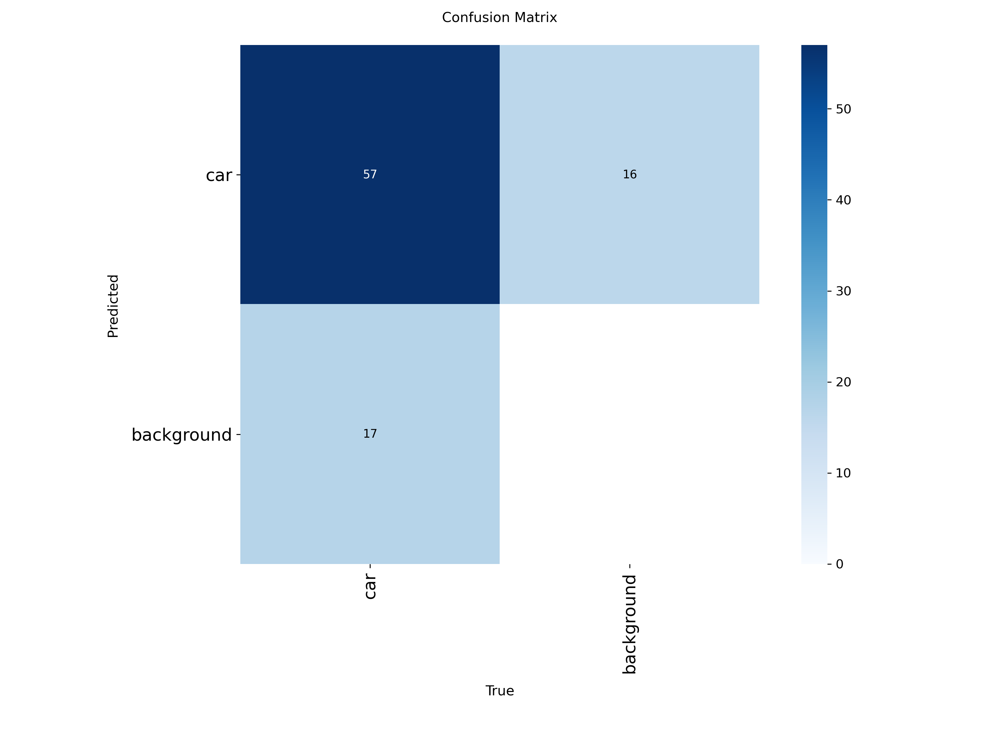

# YOLOv11_SAM_2: Object Counting and Automatic Labeling with SAM2

## Project Overview

This project combines the power of YOLOv11 for object detection and counting with the Segment Anything Model (SAM2) for automatic image labeling and vehicle classification. 


## Idea and Solution
The idea is to combine two solutions proposed by ultralytics: object counting and object counting in region, in order to overcome the limitations of each individual method. specifically, object counting can only count the total number of objects in a single selected area, while object counting in region allows for region-based segmentation but only counts the objects currently present in each region. The proposed approach aims to count the number of vehicles passing through each individual lane, while integrating the classification capability of SAM2.

<div align="center">*video demo*</div>

## Features and Functionality

*   **Object Detection and Tracking:** Utilizes YOLOv11 for real-time object detection and tracking of vehicles in video streams.
*   **Region-Based Counting:** Implements object counting within user-defined polygonal regions.  Allows for counting objects moving in specific directions ("IN" and "OUT", or "LEFT LANE" and "RIGHT LANE").
*   **Automatic Labeling with SAM2:** Integrates SAM2 to automatically generate segmentation masks for detected objects based on point prompts.
*   **Dataset Generation:** Generates labeled datasets in YOLO format from video frames using SAM2 masks and YOLOv11 bounding boxes.
*   **Vehicle Classification (Potential):** Can be extended for vehicle classification based on the generated labels and bounding boxes.
*   **Visual Annotations:** Displays bounding boxes, object counts, and region boundaries on the video stream.
*   **Configurable Regions:** Defines counting regions as polygons with configurable colors and names.
*   **Directional Counting:**  Can be configured to count objects moving "IN" or "OUT" of a region, or in "LEFT LANE" or "RIGHT LANE", depending on the region's orientation and object movement.

## SAM2 Training result

<div align="center">*training_result*</div>


<div align="center">*batch_train*</div>

<p align="center">
  
  
</p>
<p align="center">
  
  
</p>
<div align="center">*graph*</div>
<p align="center">
  
  
</p>
<div align="center">*confusion matrix*</div>


## Technology Stack

*   **Python:** Primary programming language.
*   **OpenCV (cv2):** For video processing and image manipulation.
*   **Ultralytics YOLOv11:** Object detection and tracking framework.
*   **Ultralytics SAM2:** Segment Anything Model integration for automatic labeling.
*   **NumPy:** For numerical computations and array manipulation.
*   **Shapely:** For geometric operations, specifically for defining and working with polygonal regions.
*   **PyTorch:** Deep learning framework (underlying YOLOv11 and SAM2).

## Prerequisites

Before running the project, ensure you have the following installed:

1.  **Python:** Version 3.7 or higher is recommended.
2.  **Pip:** Python package installer.

Install the required Python packages using pip:

```bash
pip install opencv-python ultralytics numpy shapely
```

3. Download the pre-trained SAM model "sam2.1_b.pt" and place it in the root directory.

## Installation Instructions

1.  **Clone the repository:**

    ```bash
    git clone https://github.com/vanhdev-web/YOLOv11_SAM_2.git
    cd YOLOv11_SAM_2
    ```

2. **Install dependencies:**

   ```bash
   pip install -r requirements.txt # If a requirements.txt file is added later
   ```
   Or:
   ```bash
   pip install opencv-python ultralytics numpy shapely
   ```

## Usage Guide

### 1. Automatic Labeling with SAM (sam.py)

This script demonstrates how to use SAM2 for automatic image labeling.

*   **File:** `sam.py`
*   **Purpose:** Takes a single image and a list of points as input.  Uses SAM2 to generate a segmentation mask based on those points, and then converts the segmentation mask to a YOLO-format label file.
*   **Input:**
    *   Image: Located in the `/cars` directory (e.g., `cars/frame0.jpg`).  Images are generated by `get_frames.py`.
    *   Points: Defined directly in the script. These points are used as prompts for SAM2 to generate the segmentation mask. *Crucially, the script currently uses hardcoded points specific to `frame0.jpg`.  These *must* be updated for other frames to work correctly.*
*   **Output:**
    *   YOLO-format label file: A `.txt` file with the same name as the input image (e.g., `frame0.txt`).  This file contains the object class and normalized bounding box coordinates.
    *   Annotated image: Displays the image with the segmentation mask applied in a cv2 window.
*   **Steps:**

    1.  Place the desired image in the `/cars` directory. Make sure the `/cars` directory exists.
    2.  **Crucially:**  Update the `points` variable in `sam.py` with the appropriate point prompts for *your* image.  **The existing points are only valid for `frame0.jpg`**. These points are the key input to SAM.
    3.  Run the script:

        ```bash
        python sam.py
        ```

    4.  The annotated image will be displayed, and the YOLO-format label file (`.txt`) will be created.

*   **Important Notes:**
    *   The `sam2.1_b.pt` model is loaded.  Ensure this model file is in the same directory as `sam.py` or specify the correct path.
    *   The script currently only processes *one* image at a time.  To process multiple images, you will need to modify the script to iterate over a list of images and their corresponding point prompts.
    *   The generated label file uses class "0".  This can be adjusted in the script if needed.
    *   The quality of the segmentation depends heavily on the accuracy of the point prompts.  Choose points that lie well within the object you want to segment.
    *   The output YOLO format is `<object-class> <x_center> <y_center> <width> <height>`.

### 2. Extracting Frames from Video (get\_frames.py)

This script extracts frames from a video file and saves them as images.

*   **File:** `get_frames.py`
*   **Purpose:** To extract still frames from a video at regular intervals. These frames can then be used as input for SAM2 labeling.
*   **Input:**
    *   Video file:  The script assumes a video file named `org_video.mp4` is located in the `/object counting/` directory.
*   **Output:**
    *   Image files: Saves frames as JPEG images in the `cars/` directory.  The frames are named `frame{frame_count}.jpg`.
*   **Steps:**

    1.  Place the video file `org_video.mp4` in the `/object counting/` directory.
    2.  Create the `cars/` directory if it doesn't exist.
    3.  Run the script:

        ```bash
        python get_frames.py
        ```

    4.  The script will extract frames every 100 frames and save them in the `cars/` directory. The script only grabs 8 frames, and then it stops. The image name will be `frame{frame_count}.jpg`.
*   **Configuration:**
    *   `video`:  Specifies the path to the input video file.
    *   `frame_count % 100 == 0`: This condition determines the frequency of frame extraction (every 100 frames).
    *   `counter == 8`: This condition stops the script after extracting 8 frames.

### 3. Object Counting with Region Counting (region\_counter.py, mix\_solutions.py)

These scripts demonstrate how to use YOLOv11 for object detection and counting within specified regions.  `mix_solutions.py` contains the logic for directional counting (LEFT LANE/RIGHT LANE).  `region_counter.py` does not have this logic.

*   **Files:** `region_counter.py`, `mix_solutions.py`
*   **Purpose:** To count the number of objects detected within predefined polygonal regions in a video stream.
*   **Input:**
    *   Video file:  The scripts assume a video file named `org_video.mp4` is located in the `/SAM/` directory.
    *   YOLOv11 model: A pre-trained YOLOv11 model (e.g., `yolo11n.pt` or `runs/detect/train/weights/best.pt`).  The path to the model is specified in the script.
    *   Region definitions:  Defined as a dictionary of polygons in the `region_points` variable.
*   **Output:**
    *   Annotated video: Saves a video file (`out.mp4` for `region_counter.py`, `../SAM/region_counting.mp4` for `mix_solutions.py`) with bounding boxes, region boundaries, and object counts displayed.
    *   Console output (for `mix_solutions.py`): Prints the classwise counts for each region.
*   **Steps:**

    1.  Place the video file `org_video.mp4` in the `/SAM/` directory.
    2.  Download a pre-trained YOLOv11 model (e.g., `yolo11n.pt`) and place it in the appropriate location or train your own model.
    3.  Modify the `region_points` variable in the script to define the polygonal regions you want to count objects within. Ensure that the points are in the correct order to define the polygon.  This is a dictionary where the keys are region names and the values are lists of (x, y) coordinates.
    4.  Modify the `model` variable in the script to point to the location of your YOLOv11 model.
    5.  Run the script:

        ```bash
        python region_counter.py
        ```
        or
        ```bash
        python mix_solutions.py
        ```

    6.  The script will process the video and save the annotated video to `out.mp4` or `../SAM/region_counting.mp4`.

*   **Configuration:**

    *   `region_points`: Defines the polygonal regions for counting.  The coordinates should be relative to the video frame size.
    *   `model`: Specifies the path to the YOLOv11 model.
    *   `show`:  A boolean flag that determines whether to display the processed video in real-time.
    *   `line_width`: Thickness of bounding box and region lines.
    *   `show_in` (only in `mix_solutions.py`): Whether to show "IN" counts or "LEFT LANE" counts.
    *   `show_out` (only in `mix_solutions.py`): Whether to show "OUT" counts or "RIGHT LANE" counts.

### 4. Object Counting within a region (object\_counter.py)
This script demonstrates how to use YOLOv11 for object detection and counting within one specified region.

*   **File:** `object_counter.py`
*   **Purpose:** To count the number of objects detected within a predefined polygonal or linear region in a video stream.
*   **Input:**
    *   Video file: The script assumes a video file named `org_video.mp4` is located in the `/SAM/` directory.
    *   YOLOv11 model: A pre-trained YOLOv11 model (e.g., `yolo11n.pt`). The path to the model is specified in the script.
    *   Region definitions: Defined as a list of coordinates `region_points`.
*   **Output:**
    *   Annotated video: Saves a video file (`out.mp4`) with bounding boxes, region boundaries, and object counts displayed.
*   **Steps:**

    1.  Place the video file `org_video.mp4` in the `/SAM/` directory.
    2.  Download a pre-trained YOLOv11 model (e.g., `yolo11n.pt`) and place it in the appropriate location.
    3.  Modify the `region_points` variable in the script to define the polygonal or linear region you want to count objects within. Ensure that the points are in the correct order to define the region.
    4.  Modify the `model` variable in the script to point to the location of your YOLOv11 model.
    5.  Run the script:

        ```bash
        python object_counter.py
        ```

    6.  The script will process the video and save the annotated video to `out.mp4`.

*   **Configuration:**

    *   `region_points`: Defines the polygonal or linear region for counting. The coordinates should be relative to the video frame size.
    *   `model`: Specifies the path to the YOLOv11 model.
    *   `show`: A boolean flag that determines whether to display the processed video in real-time.
    *   `line_width`: Thickness of bounding box and region lines.
    *   `show_in`: Whether to show "IN" counts.
    *   `show_out`: Whether to show "OUT" counts.


## Contributing Guidelines

Contributions to this project are welcome! To contribute:

1.  Fork the repository.
2.  Create a new branch for your feature or bug fix.
3.  Implement your changes and test thoroughly.
4.  Submit a pull request with a clear description of your changes.

Please follow these guidelines:

*   Write clean, well-documented code.
*   Adhere to the existing code style.
*   Include unit tests for new functionality.
*   Update the README.md file with any relevant changes.

## License Information

License not specified.

## Contact/Support Information

For questions or support, please contact the repository owner through GitHub.